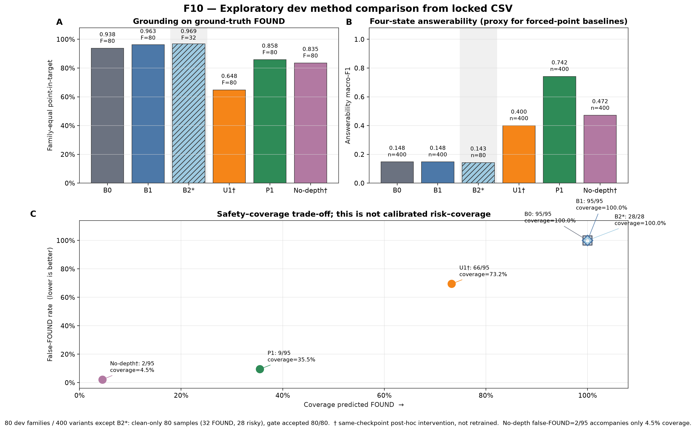
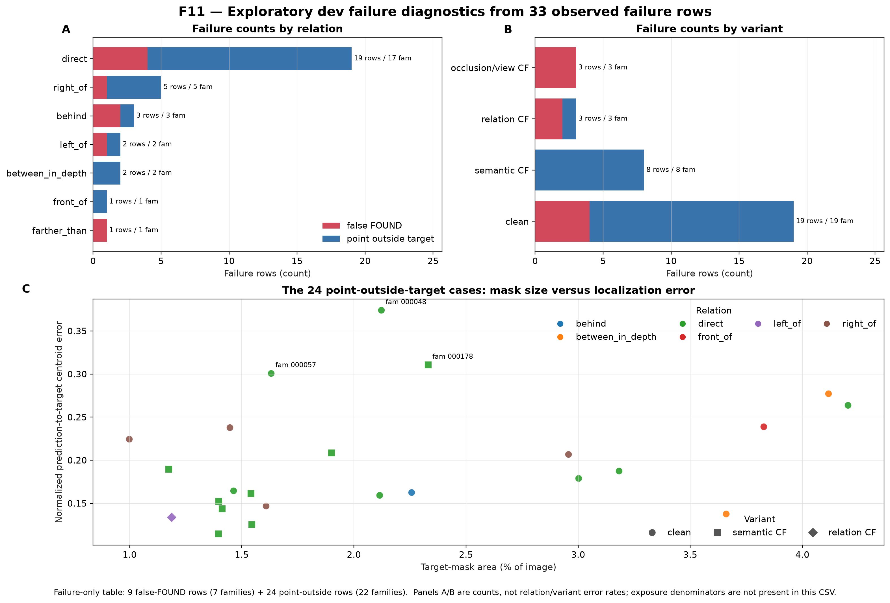
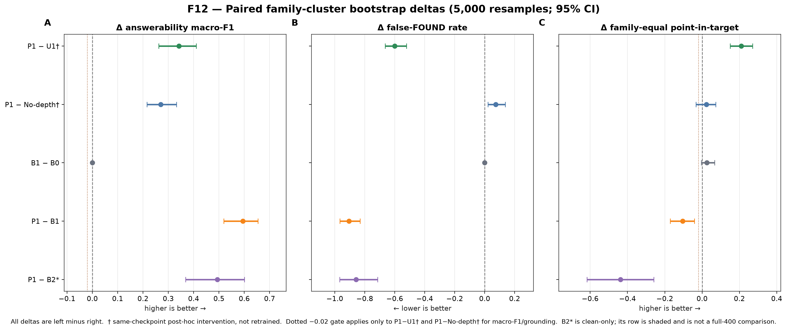

# Development audit visualization supplement

- Status: `EXPLORATORY_DEV_ONLY` and `POST_FREEZE_RENDER_ONLY`.
- Source: exactly the three corrected CSV tables requested by the user.
- Model inference/training/calibration/test access: none.

## Figures

- `F10_dev_method_comparison_from_csv`: grounding, answerability and false-FOUND/coverage trade-off.

- `F11_dev_failure_diagnostics_from_csv`: failure counts by relation/variant and the 24 point-outside diagnostic scatter.

- `F12_dev_paired_family_bootstrap_from_csv`: existing paired estimates and 95% family-bootstrap intervals.

## Interpretation constraints

- B2 is clean-only (80 samples; 32 FOUND; 28 risky) and accepted 80/80, so it is not directly comparable to full-400 methods as an improvement claim.
- No-depth has false-FOUND 2/95 together with only 4.5% predicted-FOUND coverage; the low failure count cannot be interpreted without coverage.
- The failure-case CSV contains failures only. F11 reports counts, not error rates by relation, variant, asset, mask size, or depth.
- U1 and no-depth are same-checkpoint post-hoc interventions, not retrained causal ablations.
- No ROC, ECE, calibrated risk–coverage, Calibration, Test-IID or Test-OOD result is plotted.
