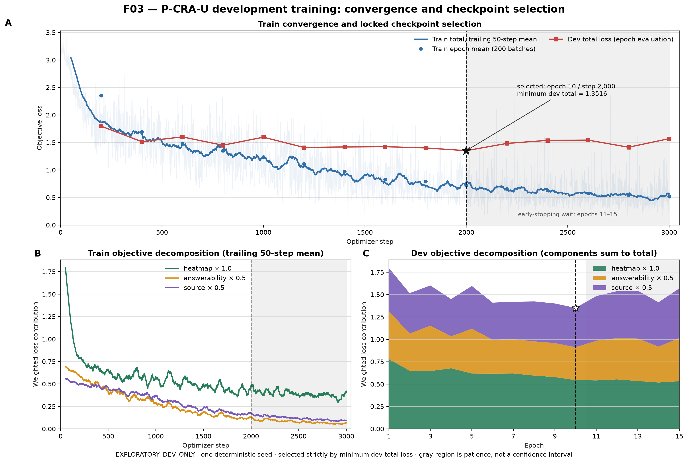
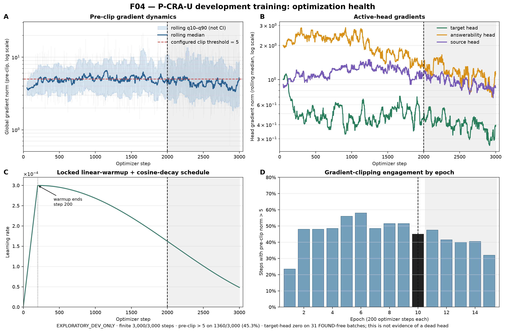
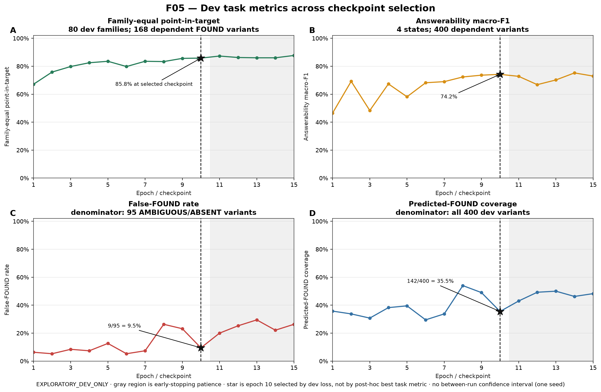

# Development training visualization supplement

- Status: `EXPLORATORY_DEV_ONLY` and `POST_TRAIN_RENDER_ONLY`.
- Source run: `pcra_u_development_train_20260824`.
- Selected checkpoint: epoch 10 / step 2,000, chosen strictly by minimum dev total loss (`1.351613`).
- Renderer activity: no model load, inference, optimizer step, calibration fit, or test access.

## Figures

### F03 — Convergence and checkpoint selection

Shows all 3,000 logged optimizer steps, a trailing 50-step train mean, the 15 dev evaluations, the weighted objective decomposition, and the locked selection point. Train loss continued downward after epoch 10 while dev total loss worsened overall, so the patience region is useful evidence against selecting the final checkpoint automatically.

### F04 — Optimization health

The global norm is logged before clipping. The q10–q90 ribbon is minibatch variability in a trailing 50-step window, not a confidence interval. Crossing the configured threshold means clipping engaged; it is not by itself evidence of exploding gradients. Post-clip norms were not logged.

### F05 — Dev metric trajectory

False-FOUND is displayed together with predicted-FOUND coverage, because a low false-FOUND rate can otherwise be obtained by rarely predicting `FOUND`. The star always denotes the checkpoint selected by the pre-registered dev-loss rule, not a post-hoc optimum for each panel.

## Denominators and interpretation limits

- Train: 320 families / 1,600 variants. Dev: 80 families / 400 dependent variants.
- Family-equal grounding uses 80 dev families; the supporting FOUND sample metric has 168 variants.
- False-FOUND uses 95 `AMBIGUOUS ∪ ABSENT` variants; coverage uses all 400 dev variants.
- This is one deterministic seed and repeated use of dev for checkpoint selection. There is no between-run confidence interval and these are not final test results.
- Calibration, Test-IID and Test-OOD remain sealed. Tables 2–6 remain `NOT_RUN`.
- The original `F02_development_loss_gradient.svg` is preserved as an engineering diagnostic; F03–F05 add numerical axes, dev trajectories and explicit denominators.
